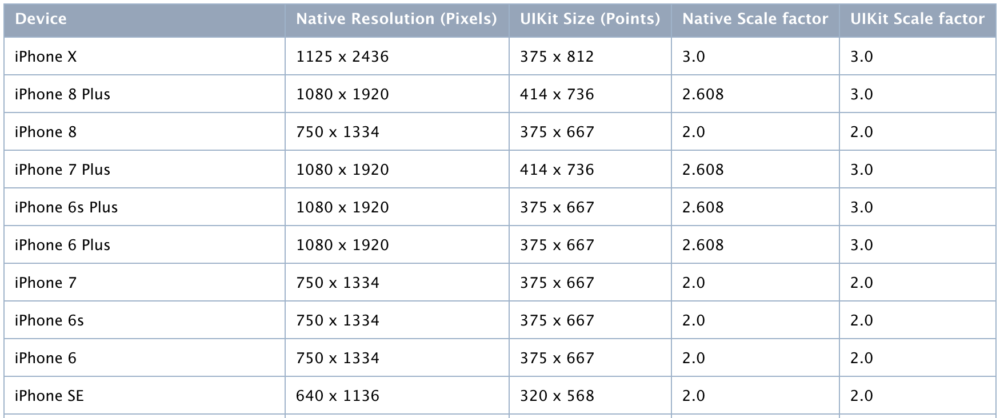

# python-wda
[](https://travis-ci.org/openatx/facebook-wda)
[](https://pypi.python.org/pypi/facebook-wda)
[]()

Facebook WebDriverAgent Python Client Library (not official)
Implemented apis describe in <https://github.com/facebook/WebDriverAgent/wiki/Queries>

Most functions finished.

Since facebook/WebDriverAgent has been archived. Recommend use the forked WDA: https://github.com/appium/WebDriverAgent

Tested with: <https://github.com/appium/WebDriverAgent/tree/v2.16.1>

## Alternatives
- gwda (Golang): https://github.com/ElectricBubble/gwda

## Installation
1. You need to start WebDriverAgent by yourself

	Follow the instructions in <https://github.com/appium/WebDriverAgent>

	It is better to start with Xcode to prevent CodeSign issues.

	But it is also ok to start WDA with command line.

	```
	xcodebuild -project WebDriverAgent.xcodeproj -scheme WebDriverAgentRunner -destination 'platform=iOS Simulator,name=iPhone 6' test
	```

	WDA在真机上运行需要一些配置，可以参考这篇文章 [ATX 文档 - iOS 真机如何安装 WebDriverAgent](https://testerhome.com/topics/7220)

	配置完之后运行下面的命令即可（需要用到Mac的密码，以及设备的UDID）
	
	```bash
	# 解锁keychain，以便可以正常的签名应用
	security unlock-keychain -p $your-mac-password-here ~/Library/Keychains/login.keychain

	# 获取设备的UDID
	UDID=$(idevice_id -l | head -n1)

	# 运行测试
	xcodebuild -project WebDriverAgent.xcodeproj -scheme WebDriverAgentRunner -destination "id=$UDID" test
	```

2. Install python wda client

	```
	pip3 install -U facebook-wda
	```

## TCP connection over USB (optional)
You can use wifi network, it is very convinient, but not very stable enough.

I found a tools named `iproxy` which can forward device port to localhost, it\'s source code is here <https://github.com/libimobiledevice/libusbmuxd>

The usage is very simple `iproxy <local port> <remote port> [udid]`

For more information see [SSH Over USB](https://iphonedevwiki.net/index.php/SSH_Over_USB)

## Something you need to know
function `window_size()` return UIKit size, While `screenshot()` image size is Native Resolution 

[](https://developer.apple.com/library/archive/documentation/DeviceInformation/Reference/iOSDeviceCompatibility/Displays/Displays.html)

when use `screenshot`, the image size is pixels size. eg(`1080 x 1920`)
But this size is different with `c.window_size()`

use `session.scale` to get UIKit scale factor

## Configuration
```python
import wda

wda.DEBUG = False # default False
wda.HTTP_TIMEOUT = 60.0 # default 60.0 seconds
```

## How to use
### Create a client

```py
import wda

# Enable debug will see http Request and Response
# wda.DEBUG = True
c = wda.Client('http://localhost:8100')

# get env from $DEVICE_URL if no arguments pass to wda.Client
# http://localhost:8100 is the default value if $DEVICE_URL is empty
c = wda.Client()
```

A `wda.WDAError` will be raised if communite with WDA went wrong.

**Experiment feature**: create through usbmuxd without `iproxy`

> Added in version: 0.9.0

class `USBClient` inherit from `Client`

USBClient connect to wda-server through `unix:/var/run/usbmuxd`

```python
import wda

# 如果只有一个设备也可以简写为
# If there is only one iPhone connecttd
c = wda.USBClient()

# 支持指定设备的udid，和WDA的端口号
# Specify udid and WDA port
c = wda.USBClient("539c5fffb18f2be0bf7f771d68f7c327fb68d2d9", port=8100)

# 也支持通过DEVICE_URL访问
c = wda.Client("usbmux://{udid}:8100".format(udid="539c5fffb18f2be0bf7f771d68f7c327fb68d2d9"))
print(c.window_size())
```

看到这里，可以看 [examples](examples) 目录下的一些代码了 

### Client

```py
# Show status
print c.status()

# Wait WDA ready
c.wait_ready(timeout=300) # 等待300s，默认120s
c.wait_ready(timeout=300, noprint=True) # 安静的等待，无进度输出

# Press home button
c.home()

# Hit healthcheck
c.healthcheck()

# Get page source
c.source() # format XML
c.source(accessible=True) # default false, format JSON

c.locked() # true of false
c.lock() # lock screen
c.unlock() # unlock
c.app_current() # {"pid": 1281, "bundleId": "com.netease.cloudmusic"}
```

Take screenshot save as png

```py
c.screenshot('screen.png') # Good
c.screenshot("screen.jpg") # Bad

# convert to PIL.Image and then save as jpg
c.screenshot().save("screen.jpg") # Good

c.appium_settings() # 获取appium的配置
c.appium_settings({"mjpegServerFramerate": 20}) # 修改配置
```

### Session
> From version 0.7.0, All Session methods moved to Client class. now Session is alias of Client

Open app

```py
with c.session('com.apple.Health') as s:
	print(s.orientation)
```

Same as

```py
s = c.session('com.apple.Health')
print(s.orientation)
s.close()
```

For web browser like Safari you can define page whit which will be opened:
```python
s = c.session('com.apple.mobilesafari', ['-u', 'https://www.google.com/ncr'])
print(s.orientation)
s.close()
```

Other app operation (Works in [appium/WebDriverAgent](https://github.com/appium/WebDriverAgent))

```bash
c.app_current() # show current app info
# Output example --
# {'processArguments': {'env': {}, 'args': []},
# 'name': '',
# 'pid': 2978,
# 'bundleId': 'com.apple.Preferences'}

# Handle alert automatically in WDA (never tested before)
# alert_action should be one of ["accept", "dismiss"]
s = c.session("com.apple.Health", alert_action="accept")

# launch without terminate app (WDAEmptyResponseError might raise)
c.session().app_activate("com.apple.Health") # same as app_launch

# terminate app
c.session().app_terminate("com.apple.Health")

# get app state
c.session().app_state("com.apple.Health")
# output {"value": 4, "sessionId": "xxxxxx"}
# different value means 1: die, 2: background, 4: running
```

### Session operations
```python
# set default element search timeout 30 seconds
s.implicitly_wait(30.0)

# Current bundleId and sessionId
print(s.bundle_id, s.id)

s.home() # same as c.home(), use the same API

s.lock() # lock screen
s.unlock() # unlock screen
s.locked() # locked status, true or false

s.battery_info() # return like {"level": 1, "state": 2}
s.device_info() # return like {"currentLocale": "zh_CN", "timeZone": "Asia/Shanghai"}

s.set_clipboard("Hello world") # update clipboard
# s.get_clipboard() # Not working now

# Screenshot return PIL.Image
# Requires pillow, installed by "pip install pillow"
s.screenshot().save("s.png")

# Sometimes screenshot rotation is wrong, but we can rotate it to the right direction
# Refs: https://pillow.readthedocs.io/en/3.1.x/reference/Image.html#PIL.Image.Image.transpose
from PIL import Image
s.screenshot().transpose(Image.ROTATE_90).save("correct.png")

# One of <PORTRAIT | LANDSCAPE>
print(s.orientation) # expect PORTRAIT or LANDSCAPE

# Change orientation
s.orientation = wda.LANDSCAPE # there are many other directions

# Deactivate App for some time
s.deactivate(5.0) # 5s

# Get width and height
print(s.window_size())
# Expect tuple output (width, height)
# For example: (414, 736)

# Get UIKit scale factor, the first time will take about 1s, next time use cached value
print(s.scale)
# Example output: 3

# Simulate touch
s.tap(200, 200)

# Very like tap, but support float and int argument
# float indicate percent. eg 0.5 means 50%
s.click(200, 200)
s.click(0.5, 0.5) # click center of screen
s.click(0.5, 200) # click center of x, and y(200)

# Double touch
s.double_tap(200, 200)

# Simulate swipe, utilizing drag api
s.swipe(x1, y1, x2, y2, 0.5) # 0.5s
s.swipe(0.5, 0.5, 0.5, 1.0)  # swipe middle to bottom

s.swipe_left()
s.swipe_right()
s.swipe_up()
s.swipe_down()

# tap hold for 1 seconds
s.tap_hold(x, y, 1.0)

# Hide keyboard (not working in simulator), did not success using latest WDA
# s.keyboard_dismiss()

# press home, volumeUp, volumeDown
s.press("home") # fater then s.home()
s.press("volumeUp")
s.press("volumeDown")
```

### Find element
> Note: if element not found, `WDAElementNotFoundError` will be raised

```python
# For example, expect: True or False
# using id to find element and check if exists
s(id="URL").exists # return True or False

# using id or other query conditions
s(id='URL')

# using className
s(className="Button")

# using name
s(name='URL')
s(nameContains='UR')
s(nameMatches=".RL")

# using label
s(label="label")
s(labelContains="URL")

# using value
s(value="Enter")
s(valueContains="RL")

# using  visible, enabled
s(visible=True, enabled=True)

# using index, index must combined with at least on label,value, etc...
s(name='URL', index=1) # find the second element. index of founded elements, min is 0

# combines search conditions
# attributes bellow can combines
# :"className", "name", "label", "visible", "enabled"
s(className='Button', name='URL', visible=True, labelContains="Addr")
```

More powerful findding method

```python
s(xpath='//Button[@name="URL"]')

# another code style
s.xpath('//Button[@name="URL"]')

s(predicate='name LIKE "UR*"')
s('name LIKE "U*L"') # predicate is the first argument, without predicate= is ok
s(classChain='**/Button[`name == "URL"`]')
```

To see more `Class Chain Queries` examples, view <https://github.com/facebookarchive/WebDriverAgent/wiki/Class-Chain-Queries-Construction-Rules>

### Get Element info
```python
e = s(text='Dashboard').get(timeout=10.0)

# get element attributes
e.className # XCUIElementTypeStaticText
e.name # XCUIElementTypeStaticText  /name
e.visible # True    /attribute/visible
e.value # Dashboard /attribute/value
e.label # Dashboard /attribute/label
e.text # Dashboard  /text
e.enabled # True    /enabled
e.displayed # True  /displayed

e.bounds # Rect(x=161, y=32, width=53, height=21)  /rect
x, y, w, h = e.bounds


```

### Element operations (eg: `tap`, `scroll`, `set_text` etc...)
Exmaple search element and tap

```python
# Get first match Element object
# The function get() is very important.
# when elements founded in 10 seconds(:default:), Element object returns
# or WDAElementNotFoundError raises
e = s(text='Dashboard').get(timeout=10.0)
# s(text='Dashboard') is Selector
# e is Element object
e.tap() # tap element
```

>Some times, I just hate to type `.get()`

Using python magic tricks to do it again.

```python
# 	using python magic function "__getattr__", it is ok with out type "get()"
s(text='Dashboard').tap()
# same as
s(text='Dashboard').get().tap()
```

Note: Python magic tricks can not used on get attributes

```python
# Accessing attrbutes, you have to use get()
s(text='Dashboard').get().value

# Not right
# s(text='Dashboard').value # Bad, always return None
```

Click element if exists

```python
s(text='Dashboard').click_exists() # return immediately if not found
s(text='Dashboard').click_exists(timeout=5.0) # wait for 5s
```

Other Element operations

```python
# Check if elements exists
print(s(text="Dashboard").exists)

# Find all matches elements, return Array of Element object
s(text='Dashboard').find_elements()

# Use index to find second element
s(text='Dashboard')[1].exists

# Use child to search sub elements
s(text='Dashboard').child(className='Cell').exists

# Default timeout is 10 seconds
# But you can change by
s.set_timeout(10.0)

# do element operations
e.tap()
e.click() # alias of tap
e.clear_text()
e.set_text("Hello world")
e.tap_hold(2.0) # tapAndHold for 2.0s

e.scroll() # scroll to make element visiable

# directions can be "up", "down", "left", "right"
# swipe distance default to its height or width according to the direction
e.scroll('up')

# Set text
e.set_text("Hello WDA") # normal usage
e.set_text("Hello WDA\n") # send text with enter
e.set_text("\b\b\b") # delete 3 chars

# Wait element gone
s(text='Dashboard').wait_gone(timeout=10.0)

# Swipe
s(className="Image").swipe("left")

# Pinch
s(className="Map").pinch(2, 1) # scale=2, speed=1
s(className="Map").pinch(0.1, -1) # scale=0.1, speed=-1 (I donot very understand too)

# properties (bool)
e.accessible
e.displayed
e.enabled

# properties (str)
e.text # ex: Dashboard
e.className # ex: XCUIElementTypeStaticText
e.value # ex: github.com

# Bounds return namedtuple
rect = e.bounds # ex: Rect(x=144, y=28, width=88.0, height=27.0)
rect.x # expect 144
```

Alert

```python
print(s.alert.exists)
print(s.alert.text)
s.alert.accept() # Actually do click first alert button
s.alert.dismiss() # Actually do click second alert button
s.alert.wait(5) # if alert apper in 5 second it will return True,else return False (default 20.0)
s.alert.wait() # wait alert apper in 2 second

s.alert.buttons()
# example return: ["设置", "好"]

s.alert.click("设置")
s.alert.click(["设置", "信任", "安装"]) # when Arg type is list, click the first match, raise ValueError if no match
```

Alert monitor

```python
with c.alert.watch_and_click(['好', '确定']):
	s(label="Settings").click() # 
	# ... other operations

# default watch buttons are
# ["使用App时允许", "好", "稍后", "稍后提醒", "确定", "允许", "以后"]
with c.alert.watch_and_click(interval=2.0): # default check every 2.0s
	# ... operations
```

### Callback
回调操作: `register_callback`

```python
c = wda.Client()

# the argument name in callback function can be one of
# - client: wda.Client
# - url: str, eg: http://localhost:8100/session/024A4577-2105-4E0C-9623-D683CDF9707E/wda/keys
# - urlpath: str, eg: /wda/keys  (without session id)
# - with_session: bool # if url contains session id
# - method: str, eg: GET
# - response: dict # Callback.HTTP_REQUEST_AFTER only 
# - err: WDAError # Callback.ERROR only
#
def _cb(client: wda.Client, url: str):
	if url.endswith("/wda/keys"):
		print("send_keys called")

c.register_callback(wda.Callback.HTTP_REQUEST_BEFORE, _cb)
c.send_keys("Hello")

# unregister
c.unregister_callback(wda.Callback.HTTP_REQUEST_BEFORE, _cb)
c.unregister_callback(wda.Callback.HTTP_REQUEST_BEFORE) # ungister all
c.unregister_callback() # unregister all callbacks
```

支持的回调有

```
wda.Callback.HTTP_REQUEST_BEFORE
wda.Callback.HTTP_REQUEST_AFTER
wda.Callback.ERROR
```

默认代码内置了两个回调函数 `wda.Callback.ERROR`，使用`c.unregister_callback(wda.Callback.ERROR)`可以去掉这两个回调

- 当遇到`invalid session id`错误时，更新session id并重试
- 当遇到设备掉线时，等待`wda.DEVICE_WAIT_TIMEOUT`时间 (当前是30s，以后可能会改的更长一些)

## TODO
longTap not done pinch(not found in WDA)

TouchID

* Match Touch ID
* Do not match Touch ID

## How to handle alert message automaticly (need more tests)
For example

```python
import wda

s = wda.Client().session()

def _alert_callback(session):
    session.alert.accept()

s.set_alert_callback(_alert_callback) # deprecated，此方法不能用了

# do operations, when alert popup, it will auto accept
s(type="Button").click()
```	

## Special property
```python
# s: wda.Session
s.alibaba.xxx # only used in alibaba-company
```

## DEVELOP
See [DEVELOP.md](DEVELOP.md) for more details.

## iOS Build-in Apps
**苹果自带应用**

|   Name | Bundle ID          |
|--------|--------------------|
| iMovie | com.apple.iMovie |
| Apple Store | com.apple.AppStore |
| Weather | com.apple.weather |
| 相机Camera | com.apple.camera |
| iBooks | com.apple.iBooks |
| Health | com.apple.Health |
| Settings | com.apple.Preferences |
| Watch | com.apple.Bridge |
| Maps | com.apple.Maps |
| Game Center | com.apple.gamecenter |
| Wallet | com.apple.Passbook |
| 电话 | com.apple.mobilephone |
| 备忘录 | com.apple.mobilenotes |
| 指南针 | com.apple.compass |
| 浏览器 | com.apple.mobilesafari |
| 日历 | com.apple.mobilecal |
| 信息 | com.apple.MobileSMS |
| 时钟 | com.apple.mobiletimer |
| 照片 | com.apple.mobileslideshow |
| 提醒事项 | com.apple.reminders |
| Desktop | com.apple.springboard (Start this will cause your iPhone reboot) |

**第三方应用 Thirdparty**

|   Name | Bundle ID          |
|--------|--------------------|
| 腾讯QQ | com.tencent.mqq |
| 微信 | com.tencent.xin |
| 部落冲突 | com.supercell.magic |
| 钉钉 | com.laiwang.DingTalk |
| Skype | com.skype.tomskype |
| Chrome | com.google.chrome.ios |


Another way to list apps installed on you phone is use `ideviceinstaller`
install with `brew install ideviceinstaller`

List apps with command

```sh
$ ideviceinstaller -l
```

## Tests
测试的用例放在`tests/`目录下，使用iphone SE作为测试机型，系统语言应用。调度框架`pytest`

## Reference
Source code

- [Router](https://github.com/facebook/WebDriverAgent/blob/master/WebDriverAgentLib/Commands/FBElementCommands.m#L62)
- [Alert](https://github.com/facebook/WebDriverAgent/blob/master/WebDriverAgentLib/Commands/FBAlertViewCommands.m#L25)

## Thanks
- https://github.com/msabramo/requests-unixsocket
- https://github.com/iOSForensics/pymobiledevice

## Articles
* <https://testerhome.com/topics/5524> By [diaojunxiam](https://github.com/diaojunxian)

## Contributors
* [diaojunxian](https://github.com/diaojunxian)
* [iquicktest](https://github.com/iquicktest)

## DESIGN
[DESIGN](DESIGN.md)

## LICENSE
[MIT](LICENSE)

